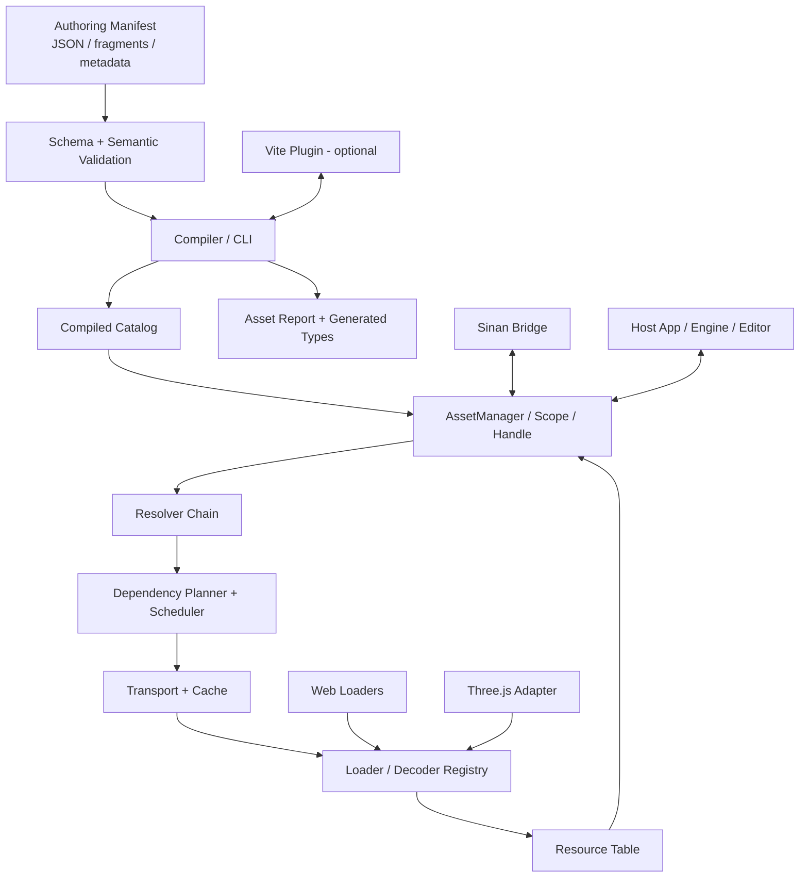
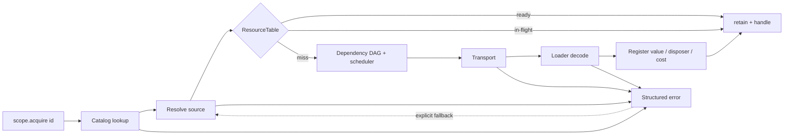

# Indirection｜寻址

## Web 游戏资源寻址与加载系统：架构与技术选型设计

- 文档版本：0.1
- 状态：设计基线 / 待评审
- 日期：2026-06-20
- 项目定位：独立发布、引擎中立、manifest-first 的 Web 游戏资源协议、构建工具与运行时
- 首个集成宿主：Sinan Engine（原 Sinan Scene Director 范围已升级为引擎内 Director System）

> 2026-06-20 Sinan 对齐说明：Sinan 最新 RFC 与合作函明确要求 Sinan 保留 authoring manifest、schema、ReferenceResolver、budget/report policy 与 fallback policy。Indirection 的研发顺序和合作边界以 `docs/rd-plan-sinan-alignment-2026-06-20.md` 为准；本文仍作为 v0.1 架构基线与原始设计记录。

---

## 0. 决策摘要

本项目应作为**独立基础设施项目**研发，而不是并入某个具体引擎成为内部资源模块。Sinan Engine 适合作为首个真实宿主、集成样例和回归测试场，但 Indirection 的核心包不得依赖 Sinan、React、Three.js 或 Vite。

核心设计结论如下：

1. **资源身份与物理位置分离**：业务代码只引用稳定 `AssetId`，URL、CDN、压缩格式、质量档位和缓存位置由 catalog 与 resolver 决定。
2. **编辑源与运行时产物分离**：人类和 AI 编辑 authoring manifest；构建期校验并生成只读 compiled catalog。运行时对象、内存缓存和引擎场景树均不是事实源。
3. **运行时核心零外部依赖**：核心只负责寻址、依赖、调度、状态、生命周期与可观测性；Zod、Three.js、Vite 均放在外围包。
4. **显式生命周期**：主 API 使用 `AssetHandle` 与 `AssetScope`，而不是只返回裸对象后要求调用者凭字符串 `release(id)`。
5. **不自造 AssetBundle 格式**：第一阶段复用 URL、HTTP/CDN、浏览器缓存、Cache Storage 以及 glTF/KTX2 等标准格式。
6. **构建期严格、运行期轻量**：完整 schema、引用、依赖环、预算和文件检查在 Node 工具链完成；运行时只保留必要防御。
7. **适配器优先**：通用 Web loader、Three.js adapter、Vite plugin、Sinan bridge 均是可选集成层。
8. **确定性优先**：catalog 输出可复现；variant 使用“声明顺序首个匹配”；fallback 必须显式声明；错误具有稳定 code 和上下文。
9. **ESM-only**：面向现代 Web 与现代 Node 工具链，不为历史 CommonJS/UMD 增加首版复杂度。
10. **首版重点不是功能数量，而是协议稳定性**：优先完成 ID、catalog、loader contract、handle/scope、错误模型和 compiler API。

---

## 1. 背景与问题定义

现代 Web 已经提供 URL、ESM、动态 import、CDN、HTTP Cache、Fetch、Service Worker 等底层能力，但游戏和交互式 3D 项目仍然缺少一层统一的**游戏资源语义**：

- 业务对象需要稳定逻辑 ID，而不是散落的相对路径。
- 同一资源可能因质量、语言、平台或设备能力选择不同文件。
- 模型、纹理、音频、配置之间存在显式依赖和场景级分组。
- 下载完成不等于资源可用；还存在解析、转码、GPU 上传和销毁阶段。
- 相同资源的并发请求需要去重，取消语义需要支持共享请求。
- 场景退出时需要可靠释放 CPU/GPU 资源，而不是依赖 JavaScript GC 猜测所有权。
- 构建期需要引用校验、资源报告、预算阈值、内容哈希和迁移能力。
- 编辑器和 AI agent 需要可 diff、可验证、可迁移的数据协议。

Sinan 当前已经采用 `data/assets.manifest.json` 作为资源事实源，Three.js 细节限制在 runtime adapter 内，并计划推进 asset metadata、预算校验、资源报告和压缩加载策略。其合作要求还包括结构化错误、确定性 fallback，以及尽量保留现有 `WebRuntime.loadModel(assetId, url)` 边界。因此，Sinan 很适合作为 Indirection 的首个 POC，但不能成为其架构边界。[S1]

### 1.1 项目一句话定义

> **Indirection 是一个面向 Web 游戏与 3D 编辑器的、manifest-first 的资源寻址协议、构建工具和运行时。**

它解决的是：

```text
稳定资源 ID
    ↓
可校验 manifest / compiled catalog
    ↓
variant 与依赖解析
    ↓
transport / cache / loader adapter
    ↓
带生命周期的运行时资源句柄
```

它不是“又一个 `fetch()` 封装”，也不是“Web 版 Unity AssetBundle”。

---

## 2. 目标与非目标

### 2.1 核心目标

- 通过稳定 `AssetId` 访问资源，业务代码不感知最终 URL。
- 支持 manifest 分片、schema、引用校验、迁移和确定性编译。
- 支持资源依赖、group、preload、variant、fallback 和 typed metadata。
- 支持并发限制、优先级、请求去重、取消、重试和进度事件。
- 支持内存缓存、引用计数、成本估算、淘汰和显式 dispose。
- 支持 renderer-neutral loader contract。
- 提供 Web 通用 loader 与 Three.js adapter。
- 提供 CLI、Vite plugin、报告和生成类型。
- 允许宿主通过 adapter 接入，而不要求交出自身数据事实源。
- 保持核心包小、可 tree-shake、无全局单例、无隐式网络行为。

### 2.2 首版非目标

- 不设计私有二进制资源包格式。
- 不提供 CDN、对象存储或内容托管 SaaS。
- 不实现完整资产导入器、DCC 工作流或编辑器 GUI。
- 不提供 DRM、资源加密或反破解承诺。
- 不自动实现 LOD、流式世界、虚拟纹理或增量 patch。
- 不在核心中集成 React、Three.js、Babylon.js 或特定 ECS。
- 不默认注册 Service Worker。
- 不把“所有资源永久缓存”作为默认策略。
- 不通过 `eval`、脚本字符串或 manifest 中的函数名执行任意代码。

---

## 3. 架构原则

### 3.1 Identity over location

`AssetId` 是长期稳定的业务身份；URL 是可替换的部署细节。重命名文件、迁移 CDN、切换压缩格式或新增低端资源，不应要求修改关卡、Timeline、Prefab 或业务代码。

### 3.2 Authoring manifest 与 compiled catalog 分离

Authoring manifest 面向人类、AI 和版本控制，允许注释性 metadata、分片和较友好的相对路径。Compiled catalog 面向运行时，包含规范化后的完整 ID、已解析 source、依赖、字节数、hash 和运行时必要 metadata。

### 3.3 Build-time strict, runtime lean

重复 ID、缺失依赖、group 环、fallback 环、无默认 variant、预算超限等问题必须尽量在 CI 阶段失败。运行时仍保留防御性检查，但不携带完整构建工具和 Zod。

### 3.4 Explicit ownership

加载出来的纹理、音频缓冲、几何体和 GPU 对象往往需要主动释放。调用方通过 handle 或 scope 表达“仍在使用”，而不是依赖不可观察的 GC 生命周期。

### 3.5 Web primitives first

优先复用标准 URL、Fetch、HTTP Cache、Cache Storage、AbortSignal、Web Crypto 和标准资源格式。只有当这些能力无法满足明确需求时，才引入新的存储或打包协议。

### 3.6 Adapter, not invasion

宿主决定自身实体、场景、编辑器和业务语义。Indirection 只提供资源边界；Three.js 解码器、Sinan bridge 和 Vite plugin 都必须是外接模块。

### 3.7 Deterministic and observable

同一输入应生成字节稳定的 catalog。variant、fallback、重试和淘汰规则必须可解释。每次失败都应有稳定错误码、assetId、阶段、source 和 cause。

---

## 4. 系统上下文与总体架构



### 4.1 分层

| 层 | 责任 | 禁止事项 |
|---|---|---|
| Authoring | 人类/AI 可编辑 manifest、metadata、group、variant | 不存运行时对象 |
| Schema & Compiler | 结构校验、语义校验、文件检查、hash、报告、catalog | 不依赖浏览器渲染器 |
| Protocol | 稳定数据结构、错误码、公共类型 | 不做 I/O |
| Runtime | 寻址、依赖、调度、去重、生命周期、事件 | 不直接 import Three/React/Zod |
| Transport | 获取字节或 Response、缓存、重试、credentials policy | 不负责引擎对象 |
| Loader Adapter | 将 source 转成 JSON、ImageBitmap、AudioBuffer、GLTF 等 | 不拥有全局 manager |
| Host Adapter | 将宿主资源调用映射到 Indirection | 不改变核心协议 |

---

## 5. 仓库与包设计

建议采用 pnpm workspace 的 monorepo。工作区可以让 TypeScript、运行时和最终 npm 安装都通过真实 package resolution 验证，而不是依赖只在本地生效的 `paths` 假映射。[R4][R5]

```text
indirection/
├─ packages/
│  ├─ protocol/        # @indirection/protocol
│  ├─ schema/          # @indirection/schema
│  ├─ compiler/        # @indirection/compiler
│  ├─ runtime/         # @indirection/runtime
│  ├─ loaders-web/     # @indirection/loaders-web
│  ├─ three/           # @indirection/three
│  ├─ vite/            # @indirection/vite
│  ├─ cli/             # indirection CLI
│  └─ testkit/         # @indirection/testkit（可延后发布）
├─ examples/
│  ├─ vanilla-vite/
│  └─ three-gate/
├─ fixtures/
├─ docs/
└─ .changeset/
```

### 5.1 依赖方向

```text
protocol                 (zero external dependency)
├─ runtime               (zero external runtime dependency)
│  ├─ loaders-web
│  └─ three              (peerDependency: three)
├─ schema                (dependency: zod)
│  └─ compiler           (Node-only)
│     ├─ cli
│     └─ vite            (peerDependency: vite)
└─ testkit
```

### 5.2 发布策略

首批公开包建议只发布：

- `@indirection/protocol`
- `@indirection/runtime`
- `@indirection/loaders-web`
- `@indirection/three`
- `@indirection/compiler`
- `@indirection/vite`
- `indirection` CLI

`schema` 可作为 compiler 的公开子路径或独立包；`testkit` 在外部 adapter 作者出现后再公开。

---

## 6. 数据协议设计

### 6.1 AssetId

推荐规范：

```text
[namespace:]segment(.segment)*
```

示例：

```text
game:character.hero
game:scene.gate
game:audio.door-open
system:placeholder.model
```

规则：

- 只允许小写 ASCII、数字、`.`、`-`、`_`；namespace 与主体用 `:` 分隔。
- ID 不包含扩展名，不表达文件夹层级承诺。
- manifest 内可使用局部 ID；compiler 使用 namespace 生成全限定 ID。
- ID 一旦被关卡、Prefab 或 Timeline 引用，重命名视为协议迁移。

### 6.2 类型标识

`type` 使用开放字符串 registry，而不是核心中的封闭 enum：

```text
data/json
text/plain
binary/array-buffer
image/bitmap
audio/buffer
model/gltf
texture/three
```

Loader 通过 `types` 声明自己支持的类型。Compiler 可以验证同一类型是否存在可用 loader 配置，但不理解引擎对象内部结构。

### 6.3 Authoring manifest 示例

```json
{
  "$schema": "./node_modules/@indirection/schema/manifest.v1.json",
  "schemaVersion": 1,
  "namespace": "game",
  "assets": {
    "character.hero": {
      "type": "model/gltf",
      "sources": [
        {
          "when": {
            "quality": ["low"],
            "capability": ["webgl2"]
          },
          "url": "./models/hero.low.glb"
        },
        {
          "url": "./models/hero.glb"
        }
      ],
      "dependencies": ["material.hero-style"],
      "fallback": "system:placeholder.model",
      "metadata": {
        "tags": ["character", "chapter-1"],
        "knownClips": ["Idle", "Walk"],
        "budget": {
          "transferBytes": 2500000
        }
      },
      "extensions": {
        "sinan": {
          "instancingHint": "never"
        }
      }
    }
  },
  "groups": {
    "scene.gate": {
      "assets": ["character.hero", "environment.gate", "audio.door-open"]
    }
  }
}
```

### 6.4 Source 与 variant 规则

- `sources` 按声明顺序检查，**首个满足 `when` 的 source 生效**。
- 必须存在且只能存在一个无 `when` 的默认 source，并位于数组末尾。
- 条件为纯数据的“全部匹配”，不允许表达式字符串或函数。
- 首版标准维度：`quality`、`locale`、`platform`、`capability`。
- 自定义维度通过 resolver context 扩展，但仍使用字符串集合匹配。
- Compiler 对明显不可达 source、重复规则和缺失默认 source 报错。

该模型可自然表达“支持 KTX2 时使用压缩纹理，否则使用普通纹理”，而不要求压缩资源成为硬依赖。

### 6.5 依赖与 group

- `dependencies` 表示跨 AssetId 的逻辑依赖。
- glTF 文件内部相对 URI 属于 loader 内部依赖，除非显式注册为独立 AssetId。
- group 可包含 asset 和其他 group；compiler 展平并检测 group 环。
- group 是加载策略集合，不是二进制 bundle。
- 同一 asset 可属于多个 group，不复制文件或运行时对象。

### 6.6 metadata 与 extensions

核心标准化少量通用字段：

- `tags`
- `budget.transferBytes`
- `budget.decodedBytes`（估算）
- `sourceNotes`
- `license`
- `knownClips`

引擎特定内容进入命名空间扩展：

```json
{
  "extensions": {
    "three": {},
    "sinan": {},
    "project.example": {}
  }
}
```

这样既能共享主协议，也避免核心 schema 演化成所有引擎特性的总和。

### 6.7 Compiled catalog

```json
{
  "protocolVersion": 1,
  "catalogVersion": "sha256-8dbe...",
  "assets": {
    "game:character.hero": {
      "type": "model/gltf",
      "sources": [
        {
          "when": {
            "quality": ["low"],
            "capability": ["webgl2"]
          },
          "url": "models/hero.low.7a21c9.glb",
          "bytes": 812345,
          "integrity": "sha256-..."
        },
        {
          "url": "models/hero.91f78b.glb",
          "bytes": 1854321,
          "integrity": "sha256-..."
        }
      ],
      "dependencies": ["game:material.hero-style"],
      "fallback": "system:placeholder.model"
    }
  },
  "groups": {
    "game:scene.gate": [
      "game:character.hero",
      "game:environment.gate",
      "game:audio.door-open"
    ]
  }
}
```

约束：

- 输出使用稳定 key 顺序和稳定 JSON 序列化。
- `catalogVersion` 来自规范化 payload 的 SHA-256，不包含构建时间戳。
- 构建时间、Git SHA 等非确定性信息进入单独 report，而不是 catalog hash 输入。
- package 版本与 `protocolVersion` 分开演进。

---

## 7. 运行时架构

### 7.1 核心组件

#### CatalogStore

负责读取、索引和原子替换 catalog。首版 manager 创建后 catalog 固定；开发模式可通过显式 `replaceCatalog()` 替换，不自动热更新生产资源。

#### ResolverChain

输入 asset record 与 `ResolutionContext`，输出唯一 `ResolvedSource`。默认 resolver 实现条件匹配和 URL 规范化；宿主可插入 CDN 重写、AB 分流或平台策略 resolver。

#### DependencyPlanner

构建本次 acquisition 的依赖 DAG。Compiler 已检测环，运行时仍做防御性环检查，以处理远程 catalog 或插件错误。

#### LoadScheduler

管理优先级、并发、重试和 AbortSignal。建议优先级为：

```text
critical > high > normal > low > idle
```

并发数由宿主配置，不把固定“6 并发”写死为协议。

#### Transport

负责获得 `Response` 或字节流，默认实现基于 `fetch`。重试仅针对可恢复的 GET 网络错误和明确的 5xx；decode error 不自动重试。

#### LoaderRegistry

按 asset `type` 选择 loader。Loader 可以使用 transport、请求逻辑依赖、报告进度，并返回 value、dispose 和资源成本估计。

#### ResourceTable

保存 in-flight promise、ready value、引用计数、依赖持有关系、成本和最后访问时间。它是运行时缓存，不是事实源。

### 7.2 加载流程



### 7.3 共享加载与取消

去重键至少包含：

```text
catalogVersion + fully-qualified AssetId + resolved source identity + loader identity
```

多个消费者请求相同资源时共享底层加载。某个消费者的 `AbortSignal` 终止的是它自己的等待与引用意图；只有所有等待者都取消、且尚无依赖需要该资源时，manager 才取消底层 transport。

这避免“一个 UI 面板关闭导致整个场景的共享模型加载被取消”。

### 7.4 生命周期

主 API：

```ts
const assets = createAssetManager({
  catalog,
  loaders: [jsonLoader(), imageBitmapLoader(), threeGltfLoader(options)],
  transport: createFetchTransport(),
  context: {
    quality: "high",
    locale: "zh-CN",
    capability: ["webgl2", "ktx2"]
  }
});

const sceneScope = assets.createScope("scene.gate");
const hero = await sceneScope.acquire("game:character.hero", {
  priority: "critical"
});

scene.add(hero.value.scene);

// 场景退出：释放该 scope 持有的全部资源
await sceneScope.dispose();
```

核心语义：

- `AssetHandle.release()` 幂等。
- `AssetScope` 记录其创建的所有 handle；scope dispose 后拒绝新的 acquire。
- 父资源持有依赖资源，直到父资源最后一个引用释放。
- 引用数归零后资源进入“可淘汰”状态，不要求立即销毁。
- loader 提供 `dispose(value)` 或返回 disposer。
- 调用者从资源派生实例时，必须在实例生命周期内保留原 handle。

Three.js 文档明确提醒某些 image bitmap 资源不会因失去普通 JS 引用而自动完成预期的销毁，因此显式所有权和 adapter disposer 是必要设计，而不是过度抽象。[R11]

### 7.5 Loader contract

```ts
export interface AssetLoader<T = unknown> {
  readonly id: string;
  readonly types: readonly string[];

  load(context: LoaderContext): Promise<LoadedAsset<T>>;
}

export interface LoaderContext {
  readonly assetId: AssetId;
  readonly source: ResolvedSource;
  readonly signal: AbortSignal;
  readonly transport: AssetTransport;

  acquireDependency<T = unknown>(id: AssetId): Promise<AssetHandle<T>>;
  reportProgress(progress: AssetProgress): void;
}

export interface LoadedAsset<T> {
  readonly value: T;
  readonly cost?: {
    readonly cpuBytes?: number;
    readonly gpuBytes?: number;
  };
  readonly dispose?: () => void | Promise<void>;
}
```

Loader 不直接修改全局 cache，也不能假设宿主使用 Three.js。

### 7.6 类型系统

`@indirection/runtime` 提供开放的 `AssetTypeMap`；adapter 使用 declaration merging 注册 value 类型。Compiler 生成项目级 `AssetId` 和 ID→type 映射：

```ts
export type ProjectAssetId =
  | "game:character.hero"
  | "game:environment.gate"
  | "game:audio.door-open";

export interface ProjectAssetTypes {
  "game:character.hero": "model/gltf";
  "game:environment.gate": "model/gltf";
  "game:audio.door-open": "audio/buffer";
}
```

这样可以在不把 Three 类型写进通用 catalog 的前提下，为项目代码提供 ID 自动补全和返回值推导。

---

## 8. 缓存与淘汰策略

### 8.1 四层缓存

1. **HTTP Cache**：默认首先尊重服务器 Cache-Control、ETag 和内容哈希 URL。
2. **In-flight cache**：对正在进行的相同请求去重。
3. **Decoded memory cache**：缓存 JSON、ImageBitmap、AudioBuffer、GLTF 等运行时对象。
4. **Persistent response cache（可选）**：通过 Cache Storage 保存版本化 Response。

Cache Storage 是标准 Service Worker 规范中的 Request/Response 存储，也可由 window 或 worker 使用；它适合作为可选 adapter，而不应成为核心前提。[R12]

### 8.2 为什么首版不默认使用 IndexedDB

- 对完整 HTTP Response，Cache Storage 的语义更贴合。
- IndexedDB 更适合结构化 metadata、分片下载索引和未来的断点续传。
- 过早同时维护 HTTP Cache、Cache Storage 和 IndexedDB 会制造一致性问题。

### 8.3 缓存键与版本

持久缓存键包含 catalogVersion 和 source identity。切换 catalog 时：

- 新请求只读新版本 cache。
- 老版本资源在仍有 handle 时继续可用。
- 后台或下一次启动清理超过保留数量的旧 catalog cache。
- 默认保留策略由宿主配置，不在库中静默无限增长。

### 8.4 淘汰

ResourceTable 使用：

- 引用计数作为“可否淘汰”的硬条件。
- LRU 作为候选顺序。
- loader 上报的 CPU/GPU cost 作为预算近似。
- 显式 `pin` 仅通过 scope/handle 表达，不提供永久全局 pin 字符串表。

浏览器无法可靠精确获得所有 GPU 资源成本，因此预算是可观测估算，不宣称绝对精确。

---

## 9. 错误模型与 fallback

### 9.1 稳定错误码

建议首版错误类：

```text
IND_CATALOG_INVALID
IND_ASSET_UNKNOWN
IND_TYPE_UNSUPPORTED
IND_SOURCE_UNRESOLVED
IND_DEPENDENCY_CYCLE
IND_TRANSPORT_FAILED
IND_INTEGRITY_FAILED
IND_DECODE_FAILED
IND_ABORTED
IND_SCOPE_DISPOSED
IND_FALLBACK_CYCLE
IND_BUDGET_EXCEEDED        # tooling
```

每个错误包含：

- `code`
- `assetId`
- `phase`
- `source`（若已解析）
- `recoverable`
- `cause`
- 适合日志和测试的 `toJSON()`

### 9.2 fallback

- fallback 必须在 manifest 中显式声明。
- Compiler 验证 fallback 类型兼容与无环。
- 使用 fallback 时仍发出 `asset:fallback` 事件，并保留原始错误。
- `strictFallback` 模式可将 fallback 视为测试失败，但生产仍可返回 placeholder。
- 默认 source 不等于 error fallback：前者处理设备条件，后者处理加载失败。

---

## 10. 进度与可观测性

### 10.1 事件

```text
asset:resolve
asset:queue
asset:load-start
asset:progress
asset:decode-start
asset:ready
asset:fallback
asset:error
asset:release
asset:evict
catalog:replace
```

事件通过实例级 subscribe API 暴露，不使用全局 EventBus。

### 10.2 进度语义

不伪造单一百分比。提供：

- phase
- loadedBytes / totalBytes（若服务器提供）
- completedItems / totalItems
- dependency path
- 当前 assetId

Group 汇总优先按已知字节数加权；未知大小资源单独展示 item progress。

### 10.3 调试快照

`manager.snapshot()` 返回只读诊断数据：

- 当前 catalogVersion
- in-flight / ready / failed 数量
- 每个资源的状态、refCount、source、cost、lastAccess
- scheduler 队列
- 最近结构化错误

该快照适合编辑器 DebugPanel 和自动化测试，但不是持久状态。

---

## 11. 构建工具链

### 11.1 独立 compiler API

Vite plugin 只是 compiler 的薄包装。核心构建流程必须可从 Node API 和 CLI 运行，保证 Next、Rspack、Webpack、静态站点或自定义引擎也能使用。

```ts
const result = await compileAssets({
  manifests: ["data/assets/**/*.json"],
  outDir: "dist/assets",
  publicBase: "/assets/",
  plugins: [inspectGltf(), inspectImages()],
  budgets: {
    groups: {
      "game:scene.gate": { transferBytes: 8_000_000 }
    }
  }
});
```

### 11.2 编译阶段

1. 发现 manifest 分片。
2. Zod 结构校验。
3. 合并 namespace 与完整 ID。
4. 引用、依赖、group 和 fallback 图校验。
5. variant 规则校验。
6. 文件存在性、MIME、大小和插件式 metadata 检查。
7. 计算 SHA-256、可选复制/重命名为 content-hashed 文件。
8. 计算预算并生成诊断。
9. 输出稳定 catalog、JSON report、可选 HTML report 和 `.d.ts`。

### 11.3 CLI

```bash
indirection validate
indirection build
indirection report --format html
indirection inspect game:character.hero
indirection migrate --check
```

CLI 首版使用 Node 内置参数解析能力即可，不需要引入大型命令框架。

### 11.4 Vite plugin

Vite plugin 负责：

- Dev server 中提供 `virtual:indirection/catalog`。
- 监听 manifest 和资源变化并发送 namespaced HMR event。
- Build 时通过 Vite/Rolldown emit 能力输出资源和 catalog。
- 将 Vite 生成的 hashed URL 回写到 compiled catalog。
- 复用同一 compiler API，不创建第二套 schema 或语义。

Vite 官方 plugin API同时覆盖 dev 与 build，适合做这一层集成；Vite 的 library/build 能力用于示例和集成，不作为 runtime 的必要依赖。[R6][R7]

---

## 12. Three.js adapter

`@indirection/three` 使用 peer dependency 引入 `three`，提供：

- `model/gltf` loader
- Draco / meshopt / KTX2 capability 注册
- GLTF animation clip metadata
- owned resource disposer
- 可选 clone/instantiate helper
- adapter-level cost estimator

Three 的 `GLTFLoader` 支持从 URL 加载，也支持 `parseAsync(ArrayBuffer, basePath)`，因此 adapter 可通过 Indirection transport 统一下载、进度和缓存，再交给 GLTFLoader 解析；Draco、KTX2 和 meshopt decoder 继续由 adapter 注入。[R11]

首版所有权约束：

- `handle.value` 视为共享 asset template。
- 调用方不得对共享 template 做不可逆业务修改。
- 由 template 派生的实例存活期间必须保留 handle。
- disposer 只销毁该 asset 明确拥有的资源，避免破坏外部共享材质。

---

## 13. 安全设计

- 默认 transport 只允许 GET/HEAD。
- credentials 默认为 `omit`，跨域凭据必须显式配置。
- 提供 URL policy：同源、允许的 CDN origin、协议白名单。
- manifest 不允许包含可执行函数、脚本字符串或动态 import 路径。
- Loader 注册由代码完成，而不是由远程 catalog 指定任意模块。
- 内容哈希 URL 与 HTTPS 是默认完整性基础。
- 可选运行时 SHA-256 校验使用 Web Crypto；但 `SubtleCrypto.digest()` 需要完整输入驻留内存，因此对大资源不能默认强制，否则会产生额外峰值内存。[R13]
- 未来如需可信远程 catalog，单独设计 catalog 签名；不能把普通 hash 冒充签名。

---

## 14. 技术栈选型

### 14.1 选型表

| 领域 | 选择 | 说明 |
|---|---|---|
| 语言 | TypeScript 6，strict | 公共协议与异步生命周期需要高强度类型检查；浏览器包使用 `moduleResolution: bundler`，Node 工具包使用 `nodenext`。[R2][R3] |
| 模块格式 | ESM-only | 面向现代浏览器与 Node；减少双包 hazard 和测试矩阵。 |
| Node | Node.js 24 LTS；最低支持 Node 22 LTS | 新项目以当前 LTS 为 CI 主版本，同时测试仍处于 LTS 的上一偶数版本。[R1] |
| 工作区 | pnpm workspaces | 多包依赖链接、严格依赖边界、发布前行为接近真实安装。[R5] |
| 代码构建 | `tsc -b` + project references | 核心包不捆绑，保留 ESM 模块和 tree-shaking；稳定性优先于引入 pre-1.0 bundler。 |
| Demo/集成 | Vite 8 | 提供浏览器开发体验、示例、Vite plugin 与真实 build 验证。[R6][R7] |
| Schema | Zod 4，仅 tooling/schema 包 | TypeScript-first 校验，并可生成 JSON Schema；不进入 runtime core。[R8][R9] |
| 单元测试 | Vitest | 纯算法、compiler、状态机与 package 测试。 |
| 浏览器单测 | Vitest Browser Mode + Playwright provider | 在真实浏览器验证 Fetch、Abort、CacheStorage 与解码器。[R10] |
| E2E | Playwright | Chromium/Firefox/WebKit 项目矩阵，用于 demo 与 Sinan smoke。[R14] |
| Lint | ESLint flat config + typescript-eslint typed rules | 对 floating promise、unsafe assignment、misused promise 等异步库问题进行类型感知检查。[R15] |
| Format | Prettier | 与 lint 责任分离，保持 JSON/Markdown/TS 一致。 |
| 文档 | VitePress | API、协议、adapter 指南和示例站点。 |
| 版本发布 | Changesets + SemVer | 多包协调版本、changelog 与依赖联动。[R16] |
| 包验证 | publint + Are the Types Wrong | 验证 exports、ESM 与声明文件在不同 resolution 下的正确性。 |
| Hash | Node `crypto` SHA-256；Web Crypto 可选 | 构建期确定性 hash；运行期完整性按策略启用。 |
| CI | GitHub Actions | Node/browser matrix、pack 安装、report snapshot、示例 smoke。 |

### 14.2 TypeScript 配置基线

浏览器/通用包：

```json
{
  "compilerOptions": {
    "target": "ES2022",
    "module": "preserve",
    "moduleResolution": "bundler",
    "strict": true,
    "noUncheckedIndexedAccess": true,
    "exactOptionalPropertyTypes": true,
    "noImplicitOverride": true,
    "noImplicitReturns": true,
    "noFallthroughCasesInSwitch": true,
    "useUnknownInCatchVariables": true,
    "declaration": true,
    "declarationMap": true,
    "sourceMap": true,
    "composite": true
  }
}
```

Node tooling包：

```json
{
  "compilerOptions": {
    "target": "ES2023",
    "module": "nodenext",
    "moduleResolution": "nodenext",
    "types": ["node"]
  }
}
```

### 14.3 为什么核心包不使用 Zod

- Catalog 已在构建期通过完整校验。
- 每个运行时实例携带 Zod 会增加体积和初始化成本。
- 核心只需检查 protocolVersion、必要字段和不可信远程输入。
- Dev 模式可通过可选 `@indirection/schema/runtime` 执行完整检查。

### 14.4 为什么不直接使用 Vite 构建所有发布包

Vite 非常适合浏览器库和示例，但 Indirection 同时包含 Node compiler、CLI 和浏览器 runtime。首版使用 TypeScript 原生 project references，减少构建工具耦合；Vite 只负责浏览器 demo 和可选 plugin。未来若发布流程需要单文件输出，再评估稳定版 tsdown/Rolldown，而不是提前绑定。

---

## 15. Sinan 集成方案

Sinan 的资源事实源、renderer boundary 和测试治理与本设计高度兼容。其现有要求是保留 `data/assets.manifest.json`、将 Three decoder 细节留在 `src/runtime/three/**`、暴露可测试错误，并在压缩资源未就绪时提供确定性 fallback。[S1]

### 15.1 集成原则

- Indirection 保持独立仓库和 npm 包。
- Sinan adapter 主要代码放在 Sinan 仓库，避免核心反向依赖宿主。
- 第一阶段不强迫 Sinan 改写 manifest；compiler 提供 Sinan manifest importer。
- `data/assets.manifest.json` 继续是 authoring source of truth。
- Indirection compiled catalog 是派生产物，可重新生成，不手工编辑。
- Three loader 位于 Sinan `src/runtime/three/**` 或 `@indirection/three` adapter 内。

### 15.2 迁移路径

#### POC-1：只接构建工具

- 读取现有 5 个 demo assets。
- 增加 typed metadata。
- 输出 `report-assets`、catalog 和诊断。
- 不改变当前运行时加载行为。

#### POC-2：接管模型加载

```text
WebRuntime.loadModel(assetId, legacyUrl)
    ↓
SinanAssetBridge
    ↓
sceneScope.acquire(assetId)
    ↓
@indirection/three
```

迁移期可保留 `legacyUrl` 参数并验证其与 catalog 一致；稳定后再由 Sinan 自行决定是否简化接口。

#### POC-3：场景 scope 与 group preload

- Gate Demo 启动时 preload `scene.gate`。
- 场景退出时 dispose scope。
- 验证模型、音频和 fallback 的释放行为。

#### POC-4：压缩 variant

- 有 KTX2/Draco/meshopt capability 时选择压缩 source。
- 未配置 decoder 或资源时选择默认 source。
- 不把生产压缩资源设置成测试环境硬依赖。

### 15.3 POC 验收条件

- 现有 Sinan manifest 仍是唯一编辑事实源。
- 未知 AssetId 返回稳定错误码。
- 缺失资源触发声明过的 deterministic placeholder。
- 同一模型并发加载只发生一次 transport/decode。
- Gate Demo 的 scene scope 释放后 refCount 归零并可淘汰。
- Three import boundary 仍通过。
- `typecheck`、`validate-data`、unit test 和 Playwright smoke 全部通过。
- `report-assets` 可输出每个资源和 `scene.gate` group 的 transfer budget。

---

## 16. 测试与质量门禁

### 16.1 单元与性质测试

必须覆盖：

- AssetId 规范化与冲突。
- variant 首个匹配与默认规则。
- dependency/group/fallback 环检测。
- catalog 稳定序列化与 hash 重复构建一致。
- in-flight 去重。
- 多消费者取消语义。
- handle/scope 幂等释放。
- 依赖引用计数。
- LRU 候选与预算淘汰。
- fallback 保留原始错误。
- compiler diagnostics 的稳定 code 与 path。

### 16.2 浏览器测试

- Fetch 成功、404、5xx、慢响应和中止。
- Content-Length 已知/未知时的进度。
- Cache Storage version isolation。
- ImageBitmap、AudioBuffer 和 GLTF parse。
- Chromium PR smoke；Firefox/WebKit 定期矩阵。

### 16.3 包发布测试

CI 中执行：

```bash
pnpm lint
pnpm typecheck
pnpm test
pnpm test:browser
pnpm build
pnpm pack:check
pnpm test:e2e
pnpm catalog:determinism
```

`pack:check` 应：

- 对每个公开包执行 `pnpm pack`。
- 在临时项目从 tarball 安装。
- 验证 ESM import、类型解析和 exports。
- 运行 publint 与 Are the Types Wrong。

### 16.4 体积目标

初始目标而非未经验证的承诺：

- `@indirection/protocol`：gzip 后不超过 3 KiB。
- `@indirection/runtime`：gzip 后不超过 15 KiB。
- Zod、Three 和 Vite 不得出现在 runtime core bundle graph。

超过目标需要 ADR 说明，而不是静默增长。

---

## 17. 版本与兼容性

- npm 包遵循 SemVer。
- Manifest 使用 `schemaVersion`。
- Compiled catalog 使用 `protocolVersion`。
- v0.x 可快速演化，但每次破坏性 schema 变化必须提供 migration 或明确拒绝旧版本。
- Runtime 启动时拒绝未知的更高 protocolVersion。
- Compiler 默认只输出当前 protocolVersion。
- Catalog 不承诺跨 major 版本直接兼容。
- 生成类型属于构建产物，不进入手工编辑流程。

---

## 18. 实施里程碑

### M0：协议基线

- AssetId、manifest、catalog、error code。
- Zod schema 与 JSON Schema 输出。
- 稳定 canonical JSON 与 hash。
- ADR 与 contract tests。

### M1：运行时核心

- CatalogStore、resolver、ResourceTable。
- handle、scope、dependency retain/release。
- in-flight dedup、Abort、事件。
- JSON/text/binary fake loader 测试。

### M2：Web 与 Three adapter

- Fetch transport。
- JSON、ImageBitmap、AudioBuffer loader。
- GLTF parse、Draco/KTX2/meshopt 注入。
- disposer 与资源 cost。

### M3：Compiler、CLI 与 Vite

- validate/build/report/inspect。
- 文件 hash 与 emitted asset。
- 生成 AssetId 类型。
- virtual catalog 与 HMR。

### M4：Sinan Gate Demo POC

- importer、asset report。
- Three loader replacement。
- scene scope、group preload、fallback smoke。

### M5：持久缓存与高级策略

- Cache Storage adapter。
- catalog version GC。
- quality/locale/capability variants。
- 调试快照与编辑器面板数据。

---

## 19. 风险与应对

| 风险 | 影响 | 应对 |
|---|---|---|
| 过早做成“大而全 Addressables” | 协议不稳、研发分散 | 首版禁止自定义 bundle、在线 patch 和复杂 UI |
| 核心被 Three/Sinan 污染 | 失去复用价值 | import boundary test；Three/Sinan 只能在 adapter 包 |
| 生命周期 API 太难用 | 调用者泄漏或过早释放 | scope 为主、handle 为辅；提供调试 snapshot 和 leak warning |
| variant 规则变成脚本语言 | 不可验证、不可迁移 | 只允许声明式字符串集合匹配 |
| 浏览器缓存层叠导致难以调试 | 版本不一致 | 清晰区分 HTTP/in-flight/decoded/persistent 四层，并暴露命中来源 |
| runtime integrity 校验内存峰值 | 大资源卡顿或 OOM | 默认 content hash URL；按策略和大小阈值启用 Web Crypto |
| 生成类型与 adapter 类型不一致 | TS 返回类型错误 | ID→type 由 compiler 生成；value type 由 adapter registry 注册；CI pack test |
| POC 为 Sinan 特例设计 | 独立性名存实亡 | Sinan importer/bridge 放外围；至少维护 vanilla 和 Three 独立示例 |

---

## 20. 待评审问题

1. npm scope 最终使用 `@indirection/*` 还是组织级 scope；本文包名为逻辑名。
2. AssetId 是否允许 `/`；当前建议不允许，以避免 ID 被误解为文件路径。
3. v0.1 是否公开 `replaceCatalog()`；建议仅 dev API 公开。
4. `decodedBytes` 和 `gpuBytes` 的统一估算口径需要在 Three adapter POC 后确定。
5. Three asset template 的 instantiate helper 是 v0.1 必需，还是先由宿主负责 clone。
6. 开源许可选择 MIT 或 Apache-2.0。
7. 是否在 v0.x 承诺 Node 22；若工具依赖快速抬高最低 Node 版本，应优先选择更保守依赖。

---

## 21. ADR 摘要

| ADR | 决策 |
|---|---|
| ADR-001 | Indirection 独立发布，Sinan 是首个宿主而非所有者 |
| ADR-002 | Authoring manifest 与 compiled catalog 分离 |
| ADR-003 | ESM-only、TypeScript strict |
| ADR-004 | Runtime core 零外部依赖 |
| ADR-005 | 生命周期使用 AssetHandle + AssetScope |
| ADR-006 | 首版不设计自定义 AssetBundle |
| ADR-007 | Variant 使用声明顺序首个匹配，默认 source 最后 |
| ADR-008 | Zod 只存在于 schema/compiler 层 |
| ADR-009 | HTTP Cache 默认，Cache Storage 作为可选 adapter |
| ADR-010 | Vite plugin 包装独立 compiler API |
| ADR-011 | Three.js 通过 peer adapter 接入 |
| ADR-012 | fallback 必须显式、结构化且可观测 |

---

## 22. 参考资料

### 项目上下文

- [S1] *Sinan Scene Director 项目对外协作介绍*，2026-06-19。用户提供的早期项目文档；后续合作资料已将 Sinan 定位升级为 Sinan Engine。

### 官方技术资料

- [R1] Node.js Releases: https://nodejs.org/en/about/previous-releases
- [R2] TypeScript 6.0 Release Notes: https://www.typescriptlang.org/docs/handbook/release-notes/typescript-6-0.html
- [R3] TypeScript Modules Reference: https://www.typescriptlang.org/docs/handbook/modules/reference
- [R4] TypeScript TSConfig strict/reference: https://www.typescriptlang.org/tsconfig/
- [R5] pnpm Workspaces: https://pnpm.io/
- [R6] Vite Building for Production / Library Mode: https://vite.dev/guide/build.html
- [R7] Vite Plugin API: https://vite.dev/guide/api-plugin.html
- [R8] Zod: https://zod.dev/
- [R9] Zod JSON Schema: https://zod.dev/json-schema
- [R10] Vitest Browser Mode: https://vitest.dev/guide/browser/
- [R11] Three.js GLTFLoader: https://threejs.org/docs/pages/GLTFLoader.html
- [R12] Service Workers / Cache Storage specification: https://www.w3.org/TR/service-workers/
- [R13] Web Crypto `SubtleCrypto.digest`: https://developer.mozilla.org/en-US/docs/Web/API/SubtleCrypto/digest
- [R14] Playwright Browsers: https://playwright.dev/docs/browsers
- [R15] typescript-eslint Typed Linting: https://typescript-eslint.io/getting-started/typed-linting/
- [R16] Changesets: https://changesets-docs.vercel.app/

---

## 结论

Indirection 的竞争力不在于重新实现浏览器下载器，而在于建立一套**稳定身份、可验证协议、可替换解析、显式生命周期和可观测构建管线**。最重要的产品边界是：

```text
业务与编辑数据只认识 AssetId
Indirection 负责把 AssetId 变成可管理的运行时资源
具体渲染器与宿主通过 adapter 接入
```

按照本设计推进，项目可以独立形成 Web 游戏基础设施价值，同时通过 Sinan Gate Demo 获得真实、复杂且可自动验证的首个落地场景。
